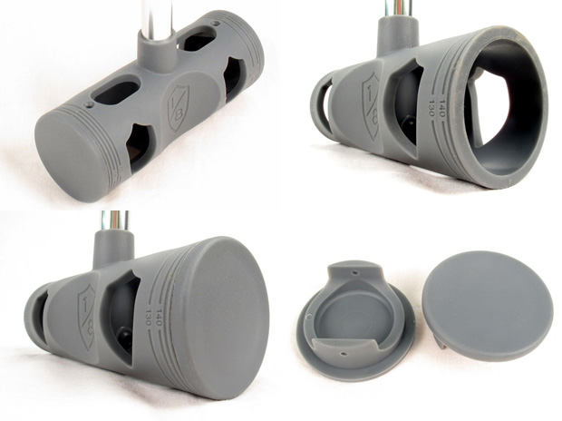

 Ça y est, la [tête de maillet de polo Eight inch](http://www.eighthinch.com/polo.html) est enfin disponible ! Comme pour le prototype qui avait été présenté dernièrement, on y retrouve énormément de détails.

\- Bouchons interchangeables - Ligne de coupe à 150mm et 130mm - Un seul point de fixation interne à la tête - Encoche pour un meilleur contrôle de la balle - ...

Il faut compter 20$ soit 15€ pour une tête avec deux bouchons ! Et il est même possible d'acheter les bouchons seuls. En vente ici : [www.eighthinch.com](http://www.eighthinch.com)

Je passe une commande dans la semaine, donc ca intéresse du monde, faites-moi signe !

A noter qu'une application "Eight Inch Polo Tournament Manager App" pour Iphone est présentée sur le site, pas encore testé ou eu d'infos, si quelqu'un en a, je suis preneur !
