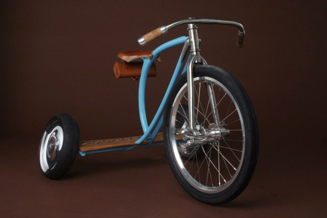

Une exposition sur six constructeurs de vélos de renommée internationale dont les travaux en métal, ainsi que graphiques reflète le rafinement, la complexité et la singularité de cet artisanat. Organisé par Michael Maharam, propriétaire de l'entreprise textile éponyme et un collectionneur passionné de vélo, avec le maître d'œuvre de Sacha White Bicycles vanille à Portland, Oregon, cette enquête est présentée dans le cadre de la série d'expositions MADProjects, qui explore les nouvelles tendances et innovations mondiales en matière de design.

\+ d'infos :[http://collections.madmuseum.org](http://collections.madmuseum.org/code/emuseum.asp?style=browse&currentrecord=1&page=seealso&profile=exhibitions&searchdesc=Future%20Exhibitions&searchstring=Future/,/greater%20than/,/0/,/false/,/true&action=searchrequest&style=single&currentrecord=2 "handbuild show")

**Bespoke | The Handbuilt Bicycle** 13 Mai au 15 Aout 2010 Museum of Arts and Design 2 Columbus Circle, New-York | 10019 212.299.7777
