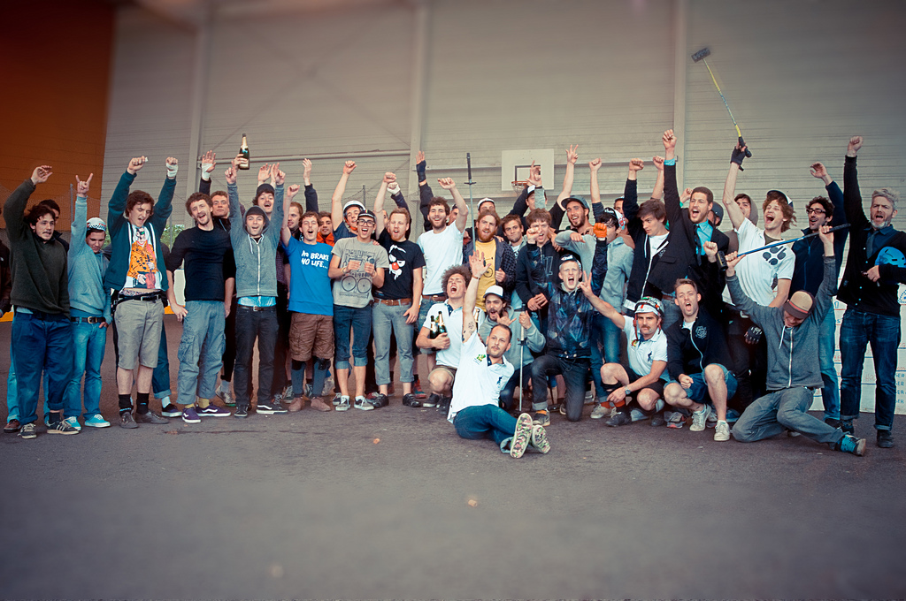

Premières photos de [Pierre Mahieu](http://www.flickr.com/photos/mahpie/sets/72157624172395628/) du tournoi FHBPC qui avait lieu à Rouen ce week-end. Deux journées 100% Polo dans une ambiance comme on les aime avec un niveau qui grimpe de plus en plus et plein de nouvelles équipes qui promettent ! Encore un grand merci à tous, les joueurs, Valentin et son équipe pour avoir filmé tout l'évènement, Pierre et Hugo pour les photos, mes parents pour la buvette et les hamburgers :), Thierry de Cycles76 pour avoir dévoilé au moins 20 roues, Nico pour vendredi soir, et tout ce que j'ai pu oublier.

On vous donne au plus vite le classement complet des 16 équipes !

**Résultat :** 1er Apologies accepted 2ème MGM 3ème Rolling Hoods 4ème Dans ta gueule, Puceau ! 5ème DBAA 6ème PolOccitan Southern Style 7ème Broken Legs 8ème Marteaux Players

9ème Les rois mages 9ème Les armoires à cuillères

11ème les sangliers sauvages 12ème Les chevaliers du Camel Toe

13ème Inglorious Rider’s 13ème SCP

16ème Frogger’s Challenge 16ème Saucy Lobstarz

\[flickr-gallery mode="photoset" photoset="72157624172395628"\]
