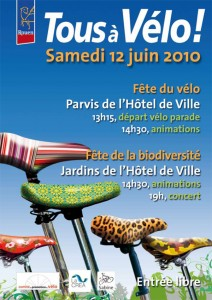

Samedi 12 juin, la Ville de **Rouen** fête le vélo sur le Parvis de l’**Hôtel de Ville** de 14h30 à 18h.

**Vélorution** Rendez-vous à 13h15 sur le parvis de l’Hôtel de Ville. Départ à 13h30 précises pour un parcours d’environ une heure dans les rues du centre-ville. Tenue de travail exigée (bleu de travail, costume, blouse blanche…) !

**Guidoline** sera présent avec un terrain de **Bike Polo** pour des initiations et démonstrations.

Le **Bicycle Roller Racing** sera toujours là pour des courses endiablées, ainsi qu'un atelier pour la découverte du pignon fixe et des petites réparations ...

* * *

Mais aussi: - Une bourse aux vélos - Séances d’initiation à la pratique du vélo urbain - Rallye Vélo en Ville - Sensibilisation aux angles morts - Animation les Vélos Folies - Location de Cy’clic - Spectacles ludoéducatifs - Spectacle  Le Vélotonome  Cie Des Frères Georges - Présentation du Cargo cycle solaire

Retrouvez aussi la **fête de la biodiversité** dans les jardins de l’Hôtel de Ville dès 14h30.

Un concert de Reggae finira cette journée à partir de 19h jusqu'à 23h, avec l’association **Babylon Yoots Foundation**.

[Programme complet (.pdf)](http://gevarouen.files.wordpress.com/2010/05/fete-du-velo-et-de-la-biodiversite-programme-12-juin-2010.pdf)

[Evènement Facebook](http://www.facebook.com/#!/event.php?eid=129248573759915&ref=mf)
