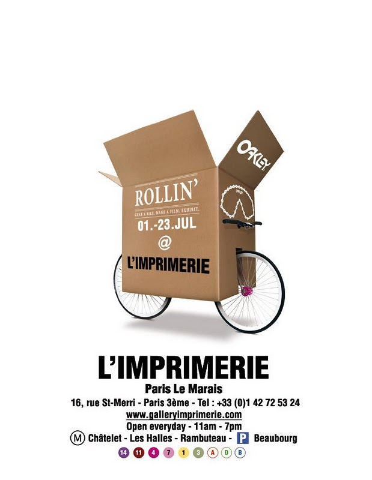

 A l'occasion du Tour de France, **Oakley** présente l'exposition **Rollin’ Paris** à [la galerie L'imprimerie](http://www.galleryimprimerie.com/) du 1er au 23 Juillet et remet au goût du jour son modèle de lunettes mythiques les **Eyeshades**.

Dix vélos équipés d’une caméra seront mis à disposition des visiteurs et pourront être empruntés le temps d’une petite balade dans les rues de Paris. Les films ainsi réalisés seront diffusés sur des écrans dans la galerie et également en ligne. Une exposition qui évolue donc au fil du temps et qui permettra à chacun d’entre nous de pouvoir être un acteur de celle-ci.

Le vernissage aura lieu le Jeudi 1er Juillet à 18H30. L’artiste [Wu Yué](http://www.5lunes.net/) y présentera son interprétation vidéo de Rollin’ Paris ainsi qu’une performance live et une bande sonore proposée par [Arthur King](http://www.myspace.com/arthurking1).

Vu sur [http://lescouillessurlapotence.wordpress.com](http://lescouillessurlapotence.wordpress.com/)
