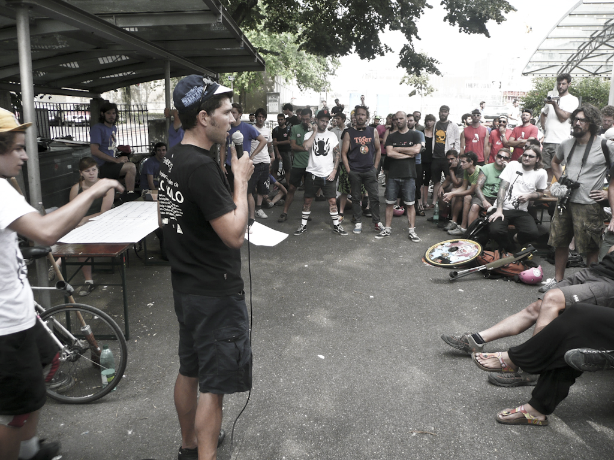

Premier jour pour les européennes de Bike Polo. La plupart des équipe françaises se sont qualifiées. On peut citer Les Marteaux, Appologies Accepted, Rolling Hoods, MGM et vos favoris, Broken Legs et DBAA. Malheureusement les Lyonnais et nos amis les Toulousains n'ont pas réussit à se qualifier. On pense à eux dans nos cœurs bébé. Super journée entres amateurs de polos, pas mal d'actions et surtout un constat : le niveau est impressionnant ! Encore une fois, l'accueil des Suisse est génial; on ne peut que les remercier de nous avoir mis dans ces conditions pour être au meilleur de notre forme. Et pour finir, comme dirait Anton, notre mascotte (inter)nationalle : "_C'est trop Chédar_". Des bisous

**Max**

\[flickr-gallery mode="photoset" photoset="72157624523331598"\]
