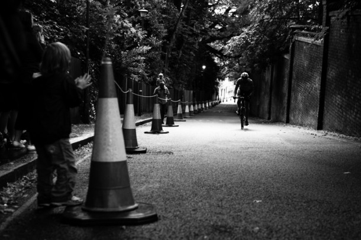

Connu pour animer la vie anglaise d'événements vélos originaux, [Rollapalluza Cycling Club](http://www.rollapaluza.com/?page_id=1607) à organisé une rencontre des meilleurs grimpeurs Londoniens sur un circuit fermé. Une foule immense s'est réunie pour encourager plus de 100 concurrents  sur cette toute première course inspirée du livre de Simon Warren “[100 greatest cycling climbs](http://www.amazon.co.uk/100-Greatest-Cycling-Climbs-Cyclists/dp/0711231206/ref=sr_1_1?s=books&ie=UTF8&qid=1279900267&sr=1-1)“. 4 catégories et comme d'habitude, de la bonne et franche humeur à l'anglaise.

[http://vimeo.com/13757661](http://vimeo.com/13757661)

 Above pic from: [Trulli](http://infamies.wordpress.com/2010/07/25/swains/)
