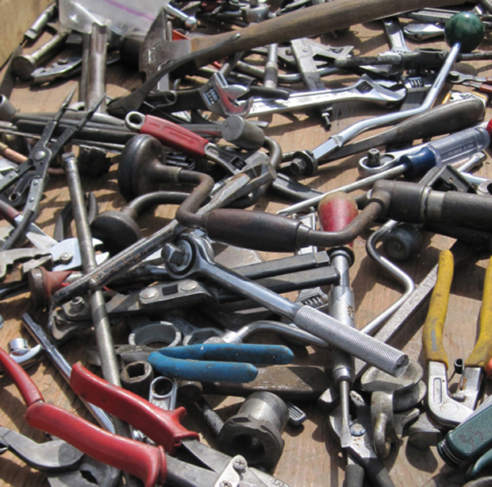

L'été est passé, vous avez repris vos activités et avez fait du tri dans votre intérieur ... Quelques vieux outils vous empêchent de fermer correctement votre placard, garage, caisse ... Pas d'hésitation : venez les déposer chez **Guidoline** qui les chérira comme vous les avez chéri.

Pinces, clés, tournevis, mèches, marteaux, maillets, scie à métaux, visseuses, meuleuses... reprendront du service.

contact 02 77 76 28 96 adresse : 51 rue Molière 76000 Rouen
