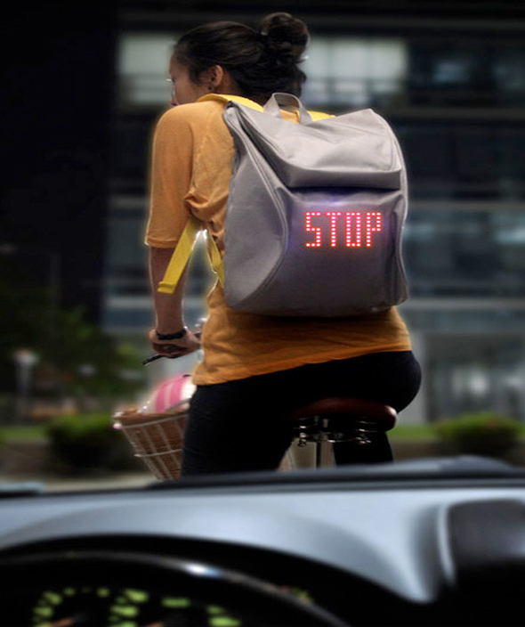

[Seil Bag](http://www.youtube.com/watch?v=HpNlsHlHQoE&feature=player_embedded#!)

Ce sac à dos va peut être révolutionner le monde de la bicyclette. Qui n’a jamais fait du vélo en ville avec la peur de ne pas être suffisamment repéré. [Lee Myung Su](http://www.leemyungsu.com/) invente le SEIL backpack, petit sac à dos avec diode, diffusant des signaux directionnels pour avertir les autres véhicules. Le sac à dos est relié à un petit contrôleur détachable sans fil, que vous accrochez à votre guidon.
