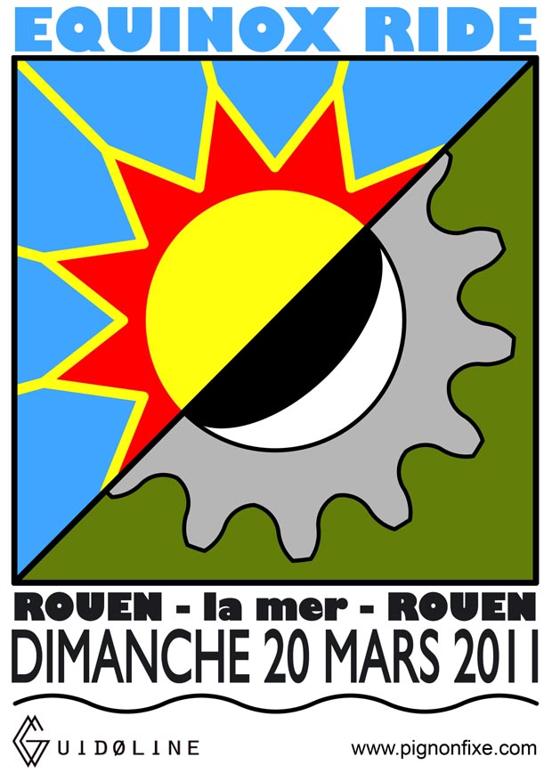

Salut à tous,

Thomas nous à concocté pour le **dimanche 20 mars** un super parcourt vélo ... pourquoi ce jour là ? Car ce sera l'équinoxe de printemps et le début de celui-ci.

Bon prétexte pour un ride buccolo-gastronomo-fixé à travers la campagne normande jusqu'à la côte, histoire de voir ce que donne un grand coef. de marée ...

**Au programme :**

\- Rendez-vous **8h30 chez Guidoline** 51 rue Molière - Une descente de la vallée de la Saâne au départ de Rouen - 66km - Moules-frites à l'hotel des bains de Quiberville ou pic-nic / baignade pour les plus motivés ! - Retour au bercail par la vallée du Dun via St Aubin - 64km

Sortie ouverte à tous même si la distance de 130km doit vous faire relativiser votre niveau de forme si vous débutez. Vous avez quand même largement le temps de vous préparer jusque là. En cas de météo impossible du type pluie/vent fort on s'autorise de droit de reporter le ride au WE d'après dès le mercredi 16 (merci windguru).

La carte : [bikemap.net](http://www.bikemap.net/route/628844 "bikemap.net") La discution forum : [Pignonfixe.com](http://www.pignonfixe.com/comments.php?DiscussionID=64908&page=1)
