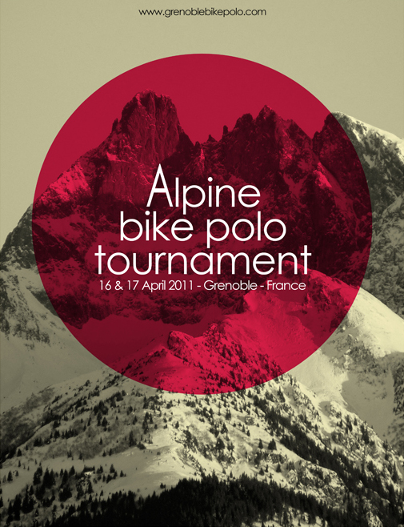

La [fine équipe Grenobloise](http://grenoblebikepolo.com/) nous a concocté pour le week-end du **16 et 17 avril l'Alpine Bike Polo Tournament**.

Au programme un vendredi en mode **Pick-up** pour se mettre en jambe avant le tournoi de samedi qui aura pour format **4 poules de 4 équipes -> classement de 1 à 16 -> Simple élimination**.

Je serais de la partie avec Pierre et Marie en mode **[Triolisme](http://www.guidoline.com/wp-content/uploads/2011/04/Triolisme-RouenBikePolo.jpg)** :) ainsi que les **Hooks** et **Anton** pour représenter **Rouen** et revenir avec la première place !

Et comme le précise Mapple, ce tournoi tombe malheureusement en même temps que le tournoi **Polo for Africa** à Paris, ainsi que l**Open** de Caen, mais c'est aussi un moyen de donner du polo à tout le monde ce week-end là.

* * *

Liste des équipes présentes:

1\. Poneys / Clément Quentin Johan / Genève 2. Moteurs Fuckeurs / Sammy Michel Laurent / Genève 3. L'équipe / Mario Lucas Manu / Genève 4. Tigers / Cento Tobia Mattia / Venise 5. Reporta Pista / Gio Giv ... / Turin & Lausanne 6. **Hooks / Woods Maks Quentin / Rouen** 7. MGM / Marmou Greg Matt / Paris 8. Dans Ta Gueule / Pierre Hugo Will / Paris & grenoble 9. C. C. Clowns / Hannes Stephen Oli / Karlsruhe 10. Shark Attack / Oli Max Thomas / Karlsruhe 11. Shaft Punk / Alex Félix Rem's / Toulouse 12. **Triolisme / Eugène Pauline Simon / Rouen** 13. Get Your Ass Kicked / Romain John Oliv / Grenoble 14. BANG BANG! / Yann Rytch Henry / Grenoble 15. **TO BE A. / Jason Flo Anton / Grenoble & Rouen** 16. Polostroïka / Dada Sam Xavier / Grenoble

\+ d'infos : [discussion Pignon Fixe du tournoi](http://www.pignonfixe.com/comments.php?DiscussionID=68719)
