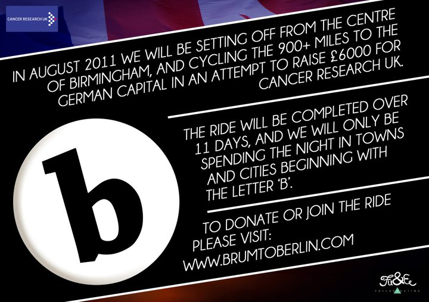

900 miles, soit 1450 km, c'est la distance qui sépare Birmingham de Berlin à vélo.

Aujourd'hui 5 riders sont partis avec comme première étape Londres, leur voyage va durer 13 jours et ils passeront dans des villes comme Calais ou Bruxelles.

Cette action a pour but principal de récolter des dons pour la lutte contre le cancer [cancerresearchuk.org](http://www.cancerresearchuk.org/)

Ils sont jeunes et font du vélo pour le plaisir, ils s'appellent Andrew Senior, Dyjan Jones, Edward Smith, Jess Duffy et Matthew Cox.

Le projet mérite d'être suivi et vous trouverez toutes les infos sur leur site [brumtoberlin.com](http://www.brumtoberlin.com/)

pour soutenir le projet : [Faire un don !](http://www.justgiving.com/brumtoberlin/eurl.axd/86cb1ddc9e2ec04882f6169eb85318e5 "Faire un don")

 

Day 1 02/08: Birmingham to London 109 miles

Day 2 03/08: London to Calais (Eurotunnel) then onto Bourbourg 90 miles

Day 3 04/08: Bourbourg to Bruges 55 miles

Day 4 05/08: In Bruges

Day 5 06/08: Bruges to Brussels 60 miles

Day 6 07/08: Brussels to Best 70 miles

Day 7 08/08: Best via Bruggen to Bottrop 85 miles

Day 8 09/08: Bottrop to Bielefeld (possibly via Beckum) 90 miles

Day 9 10/08: Bielefeld to Bremen 85 miles

Day 10 11/08: In Bremen

Day 11 12/08: Bremen to Bleckede 90 miles

Day 12 13/08: Bleckede to Breese 60 miles

Day 13 14/08: Breese to Berlin 90 miles

Day 14 15/08: In Berlin

Day 15 16/08: In Berlin

Day 16 17/08: In Berlin

Day 17 18/08: Return to London
