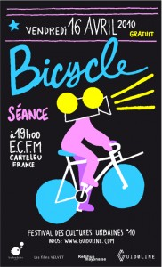

Projection dans le cadre du Festival des Cultures Urbaines de Canteleu Vendredi 16 Avril à 19h00 | Gratuit | Espace Culturel François Mitterrand

**"Le vélo de papi fait de la résistance"** Documentaire réalisé par Lagraph Production [Bob White](http://www.bobwhite-paris.com/) | France | 2010 | 26’

**"Le dernier voyage de Maryse Lucas"** Documentaire d’Artus De Lavilleon & David Ledoux Production [Les Films Velvet](http://www.lesfilmsvelvet.com/) | France | 2008 | 25’

**Paris vision Short Cut** De [Renaud SKYRONKA](http://renaudskyronka.free.fr/) | 5’

[Programme complet du Festival des Cultures Urbaines de Canteleu .pdf](http://www.guidoline.com/wp-content/uploads/2010/04/programme_fcu2010.pdf) \[flickr-gallery mode="photoset" photoset="72157623804219082"\]

* * *

  

[Le vélo de papi fait de la résistance TEASER#1](http://vimeo.com/7265366) from [h.hiolle • lagraph.net](http://vimeo.com/user886773) on [Vimeo](http://vimeo.com).

[Le Dernier Voyage de Maryse Lucas - Extraits](http://vimeo.com/8929258) from [david ledoux](http://vimeo.com/user3025861) on [Vimeo](http://vimeo.com).

["Paris-Vision" Teaser](http://vimeo.com/5623059) from [Renaud Skyronka](http://vimeo.com/androsky) on [Vimeo](http://vimeo.com).
