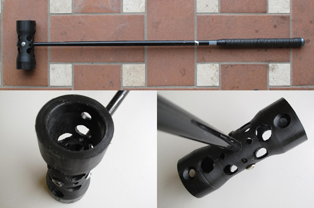

 Black heavy-mallet par [Roma Bike Polo](http://romabikepolo.org)

 Maillet dessiné par Philipp Drexler pour [Poloschläger](http://www.poloschlaeger.de) _(tube fixé par deux têtes de rayons !) Dispo pour 27€ [ici](http://www.poloschlaeger.de/index.php?/ordershops/)_

 Fabrication à la sauce [Genevoise](http://gvapolo.blogspot.com/) !

[Fabrication de cannes de polo](http://vimeo.com/5334556) from [Uolmo](http://vimeo.com/user1214048) on [Vimeo](http://vimeo.com).

\[flickr-gallery mode="photoset" photoset="72157621811424408"\] En bamboo par [RTCCHEUNG](http://www.flickr.com/people/rtcc/)
