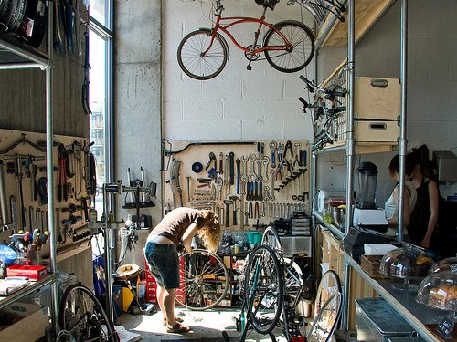

A l'heure ou les grandes enseignes se transforment et essayent de singer l'aspect des lieux alternatifs, les vrais cafés indépendants gardent leurs singularités.

L'association d'une thématique et d'un service de boissons délicatement préparées, créé des lieux bien conviviaux.

Le grand retour (logique) du vélo dans nos villes donne naissance à des espaces café/bicyclette ou il fait bon se détendre. Bientôt à Rouen?

d'après ... [bikeblogbook.blogspot.com](http://bikeblogbook.blogspot.com/)
