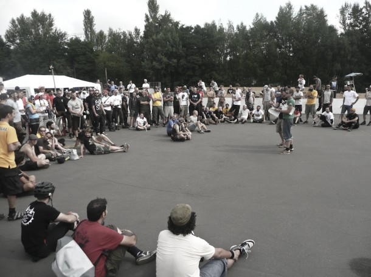

Avec un peu de retard, petit break en Bretagne oblige :) Voici quelques photos des championnats du monde qui se sont déroulés à Berlin du 12 au 15 Août. Malgré une organisation qui n'était pas vraiment à la hauteur de l'évènement et un mauvais temps pendant quasiment tout le week-end, on voit que le "Polo plaisir" passe au dessus de tout ça et on revient avec plein de bons souvenirs ! Super week-end semaine Berlinoise avec mention spéciale pour le [bar du Gymnase](http://www.flickr.com/photos/guidoline/4920148935/in/set-72157624790651700/) !

Résultat :

1\. Beaver Boys (MKE) 2. Machine Politics (CHI) 3. L'Equipe (GVA) 4. Toros (Munich) 5. Smile (Seattle) / FTB (MAD) 7. Polosynthese (Franckfurt) / Cosmic (LDN) 9. Trefoil (EastVan) / Les Puceaux / El Club / Strange Brew (EastVan) 13. Les Clowns (KA) / Bambule (Berlin) / The Odds (NYC/PHI) / La Schmoove (LDN) 17. MGM / Shark Attack (KA) / Rothen Apples (LDN) / Joe & the ... (SF) / Apologie / Bad Polo (LDN) / Massive Cogs (LDN) / Profane Lobotomy (NYC) [Tableau des scores](https://spreadsheets.google.com/ccc?key=0Autj3tqs5MHTdDc3bmVTdGVCSzR6QW5DanJodFlzNGc&hl=en#gid=1)

\[flickr-gallery mode="photoset" photoset="72157624790651700"\]
