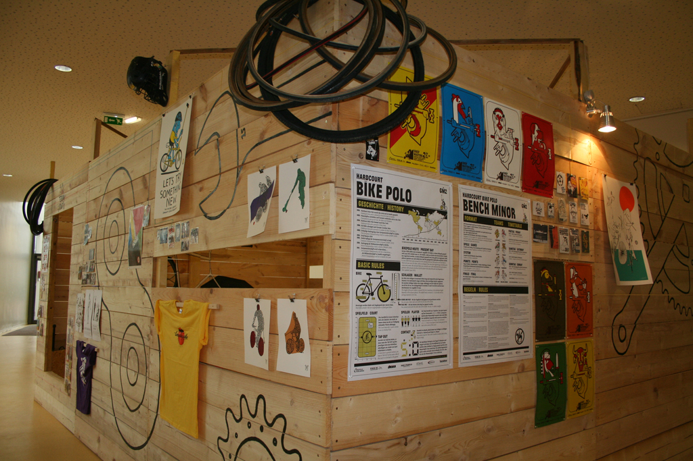

Le montage de l'exposition **Terrain Dur Bike Polo Show** se déroule depuis quelques jours à L'**ECFM** de _Canteleu_.

Une grande Partie est déjà faite et l'exposition est visible depuis mercredi dernier ! Elle va continuer à évoluer avec plein de nouveaux objets à découvrir sur les murs de ce terrain de 1vs1 qui ce nomme "_Yorgo_" en clin d'oeil à ce personnage qui à fait beaucoup pour la propagation de ce sport à travers l'Europe et pour plein d'autres raisons ...

Un après-midi et une soirée sont prévus pour découvrir l'exposition avec des ateliers, throw-in de 1vs1, un Roller Racing et une projection de films le **mercredi 20 avril** à l'ECFM de Canteleu, c'est avec plaisir que l'on vous verra là bas.

Les colis pour l'exposition sont arrivés timidement à travers le monde, mais les dons ont été sincères et méritent d'être découverts, vus ou revus par les anciens joueurs, les nouveaux ou les prochains. C'est aussi avec beaucoup de joie que de grands artiste comme _Jeremyville, Akinori Oishi, Andy Rementer, Jody Barton, Merijn Hos, Fabrice Houdry_ ... ont contribué à cette exposition. Des sérigraphies de leur travaux sur le Bike Polo ont été réalisé spécialement pour **Terrain Dur** !

L'exposition est prévue jusqu'au 30 avril 2011 dans le cadre du **11ème Festival des Cultures Urbaines** à l'Espace Culturel François Mitterrand > Parc Georges Pierre 76380 Canteleu

**Le Havre** accueillera terrain Dur Dans la cadre du Festival "**Une saison Graphique**" du 9 mai au 2 juillet 2011

Merci à toutes les personnes qui nous ont soutenu dans ce projet, qui nous l’espérons saura trouver sa place dans la communauté du Bike Polo mais surtout permettra de faire découvrir cette atmosphère si singulière à des personnes que les images ne laissent pas indifférent !

\[flickr-gallery mode="photoset" photoset="72157626498875552"\]
