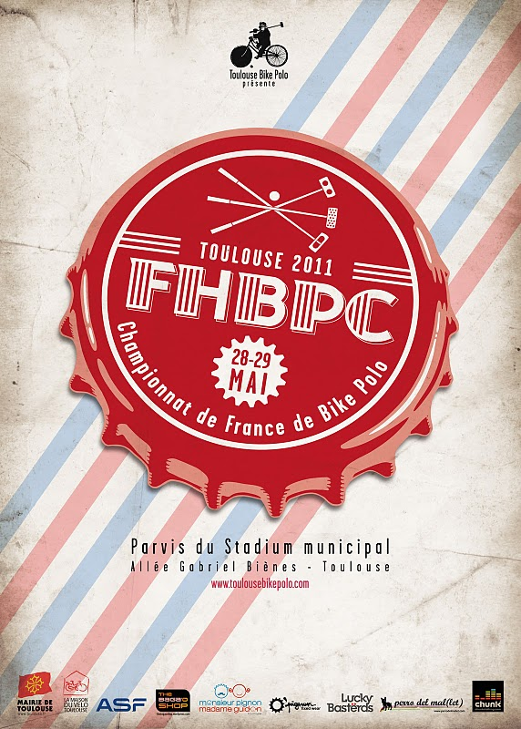

 Ce week-end se déroule la deuxième édition du **Championnat de France de Bike-Polo**. Après Rouen c'est [**Toulouse**](http://www.toulousebikepolo.com) qui accueille cette année **32 équipes de la France entière** pour un tournoi sur 2 jours avec 4 poules de 8 équipes.

Je serais de la partie pour représenter Rouen avec Robin et Cronos, ainsi que les **Hooks** [_(la meilleure équipe du monde)_](http://vimeo.com/24158744) et les **DFA**.

Résultats et photos en direct sur notre compte [Facebook](http://www.facebook.com/pages/Guidoline/356763803692) et [Twitter](http://twitter.com/_guidoline) tout fraichement créé.
